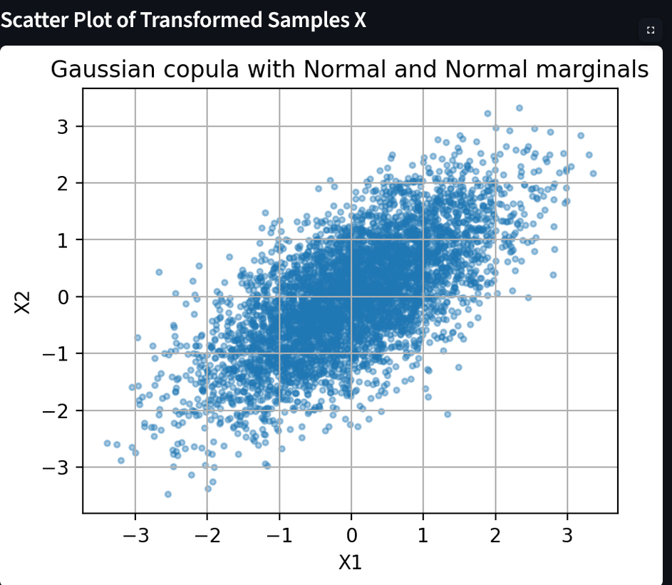
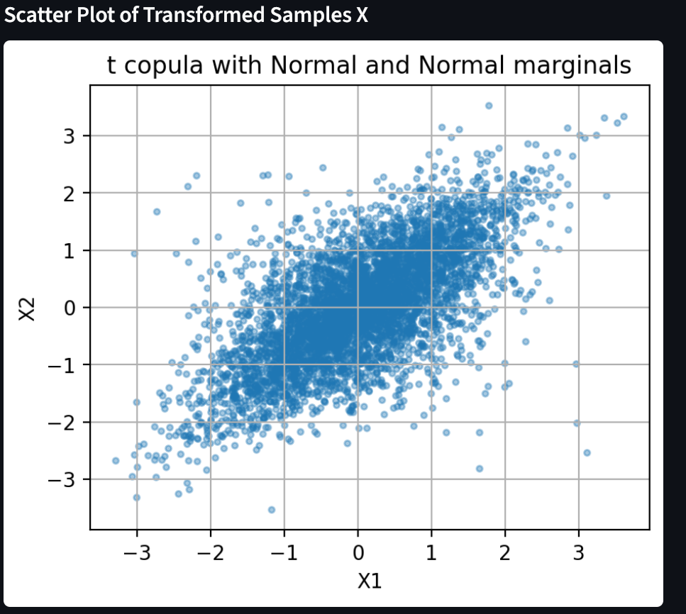

# Copula Risk Simulation


This project is a Python-based simulation tool for copula models and marginal distributions.
It allows users to generate dependent random samples using different copulas, transform them
with chosen marginal distributions, and visualize the resulting dependence structure.

The project is developed as part of a Computerpraktikum and focuses on stochastic simulation 
copulas, Monte Carlo sampling, and visulaization of multivariate distributions.


## 1. Project Overview


Copula Risk Simulation is a Python project for simulating and visualizing dependent random
vectors with copuas. The main idea is to separate a multivariate distribution into two parts:
the marginal distributions of the individual components and the copula that describes their
dependence structure.

The project implements several copula models, including the independence copula,
comonotonic copula, countermonotonic copula, Gaussian copula, and t copula. It also provides
common marignal distributions such as normal, Student-t, exponential, and uniform
distributions. Copula samples can be transformed into joint samples with user-defined
marginals.

The project also includes visulization tools for scatter plots, contour plots, and 3D surface
plots, which help illustrate different dependenc structures.


## 2. Mathematical Backgroud


The mathematical foundation of this project is Sklar's theorem. It
states that a multivariate distribution can be decomposed into its
marginal distributions and a copula.

For a random vector

$$
X = (X_1, \dots, X_d),
$$

let

$$
F_i(x_i) = P(X_i \leq x_i), \quad i = 1,\dots,d,
$$

be the marginal distribution function of the \(i\)-th component. Then
the joint distribution function can be written as

$$
F(x_1, \dots, x_d) = C(F_1(x_1), \dots, F_d(x_d)).
$$

Here, the marginal distributions \(F_i\) describe the behavior of the
individual components, while the copula \(C\) describes the dependence structure
between them.

In the simulation, the project first generates samples from a copula,

$$
U = (U_1, \dots, U_d) \sim C,
$$

where each component satisfies

$$
U_i \sim U(0, 1).
$$

These copula samples are then transformed into samples with the
desired marginal distributions by using inverse distribution
functions:

$$
X_i = F_i^{-1}(U_i).
$$

This construction makes it possible to combine different
dependence structures with different marginal distributions. For
example, the same Gaussian copula can be combined with normal,
Student-t, exponential, or uniform marginals.


## 3. Features


The project currently provides the following features:


- Simulation of several copula models:
    - Independence copula
    - Comonotonic copula
    - Countermonotonic copula
    - Gaussian copula
    - t copula


- Evaluation of copula functions:
    - Copula CDF evaluation for implemented copulas


- Support for several marginal distributions:
    - Normal distribution
    - Student-t distribution
    - Exponential distribution
    - Uniform distribution
    - Beta distribution


- Transformation of copula samples into joint samples with user-defined marginal distributions.


- Visualization of simulated samples and dependence structures:
    - 2D scatter plots of copula samples in \(U\)-space
    - 2D scatter plots of transformed samples in \(X\)-space
    - Contour plots of copula CDF functions
    - 3D surface plots of copula CDF functions


- Interactive Streamlist user interface:
    - Select copula model
    - Select marginal distributions
    - Set parameters such as correlation, degrees of freedom, sample size, and random seed
    - Generate copula samples
    - Transform copula samples into joint samples
    - Display generated samples and summary statistics
    - Visualize samples and copula CDF functions interactively


- Basic statistical functionality:
    - Empirical CDF evaluation implemented as a backend utility
    - Summary statistics of generated samples in the Streamlit UI
    - Sample correlation matrices for copula samples and transformed samples in the Streamlit UI


## 4. Installation


Clone the repository:


```bash
git clone https://github.com/RainbowstarIo/copula-risk-simulation.git
cd copula-risk-simulation
```


```bash
python -m venv .venv
```


Activate the virtual environment.

On Windows:


```bash
.venv\Scripts\activate
```


On macOS or Linux:


```bash
source .venv/bin/activate
```


```bash
pip install numpy scipy matplotlib pandas streamlit pytest
```


Run the Streamlit application:


```bash
python -m streamlit run ui.py
```


## 5. Usage Examples


### 5.1 Running the Streamlit UI


After installing the required packages, the interactive user interface can be started with:


```bash
python -m streamlit run ui.py
```


In the Streamlit interface, the user can :


- select a copula model,
- select two marginal distributions,
- set parameters such as correlation, degrees of freedom, sample size, and random seed,
- generate copula samples,
- transform them into joint samples,
- visualize the results using scatter plots, contour plots, and surface plots.


### 5.2 Generating Joint Samples in Python


The following example generates samples from a Gaussian copula and transforms them into
joint samples with normal marginal distributions.


```python
import numpy as np

from copulas import gaussian
from marginals import normal
from simulation.joint_marginals import joint_sample

P = np.array([
    [1.0, 0.7],
    [0.7, 1.0]
])

marginal_specs = [
    {
        "ppf": normal.ppf,
        "params": {"mu": 0.0, "sigma": 1.0}
    },
    {
        "ppf": normal.ppf,
        "params": {"mu": 0.0, "sigma": 1.0}
    }
]

X = joint_sample(
    copula_sample_func=gaussian.sample,
    copula_params={"P": P},
    marginal_specs=marginal_specs,
    n=1000,
    seed=42
)

print(X.shape)
print(X[:5])
```


The resulting array `X` contains simulated joint samples. Each row represents one simulated bivariate observation, while the two columns correspond to the two marginal random variables.


### 5.3 Plotting Simulated Samples


The generated samples can be visualized with a scatter plot:

```python
from plots.scatter import plot_2d_samples
import matplotlib.pyplot as plt

fig, ax = plot_2d_samples(
    X,
    title="Gaussian copula with normal marginals",
    xlabel="X1",
    ylabel="X2"
)

plt.show()
```


## 6. Project Structure


The project is organized into several modules:


```text
copula-risk-simulation/
│
├── copulas/
│   ├── independence.py
│   ├── comonotonic.py
│   ├── countermonotonic.py
│   ├── gaussian.py
│   └── t_copula.py
│
├── marginals/
│   ├── normal.py
│   ├── student_t.py
│   ├── exponential.py
│   ├── uniform.py
│   └── beta.py
│
├── simulation/
│   ├── transform.py
│   ├── joint_marginals.py
│   └── statistics.py
│
├── plots/
│   ├── scatter.py
│   ├── contour.py
│   └── surface.py
│
├── images/  
│
├── tests/
│
├── main.py
├── ui.py
└── README.md
```


## 7. Tests


The project includes automated tests for the copula models,
marginal distributions,
simluation utilities, and statistical functions.

The test suite checks, among other things:

- validation of input parameters,
- output dimensions and data types,
- reproducibility when a random seed is specified,
- uniform marginal behavior of copula samples,
- correctness of implemented coupula CDF and PDF functions,
- correctness of marginal PDF, CDF, and inverse CDF functions,
- transformation of copula samples into joint samples,
- error handling for invalid correlation matrices and distribution
  parameters.

the tests can be executed from the root directory of the project 
with:

```bash
python -m pytest
```

For a more detailed test output, use:

```bash
python -m pytest -v
```

At the current stage of development, the complete test suite contains more than 90
automated tests.

The tests are intended to verify both numerical correctness and sotfware robustness.
For stochastic functions, fixed random seeds are used where reproducibility is required.


## 8. Future Exensions


The current version focuses on the simulation and visualization of
bivariate copula modesl.
Several extensions are possible.


### 8.1 Additional Copula Families


Possible future copula models include:


- Clayton copula,
- Gumbel copula,
- Frank copula
- Joe copula,
- Marshall-Olkin copula,
- higher-dimensional Achimedean copulas.


These models would make it possible to study asymmetric
dependence and different forms of tail dependence.


### 8.2 Risk Measures


The project can be extended with financial and insurance risk measures, including:

- Value at Rist,
- Expected Shortfall,
- portfolio loss simulation,
- joint default probabilities,
- stress scenarios,
- probability of simultaneous extreme losses.


A portfolio loss could, for example, be definded by


$$
L = w_1X_1 + \dots + w_dX_d,
$$


where \(w_i\) are portfolio weights and \(X_i\) are simulated risk factors or losses.

The Value at Rist at confidence level \(\alpha\) is then given by

$$
\operatorname{VaR}_{\alpha}(L) = \inf \left\{ l \in \mathbb{R} : P(L \leq l) \geq \alpha \right\}.
$$

The Expected Shortfall can be estimated from the simulated losses beyond the corresponding
Value at Risk threshold.


### 8.3 Higher-Dimensional Simulations


The backend already supports parts of a general (d)-dimensional
implementation.
The use interface and visualization components could be extended to support
more than two marginal variables.

Possible visualization methods include:

- pair plots,
- correlation heatmaps,
- parallel coordinate plots,
- selected two-dimensional projections.


### 8.4 Parameter Estimation

A future version could estimate copula parameters from observed data. Possible methods
include:

- maximum likelihood estimation,
- pseudo-maximum likelihood estimation,
- inference functions for margins,
- rank-based estimation,
- method-of-moments estimation using Kendall's tau or Spearman's rho.

This would allow users to fit copula models to real financial, insurance, or economic data.


### 8.5 Real-World Data


The software could later support importing historical data,
transforming observations into pseudo-observations, fitting marginal distributions, and estimating copula dependence.

This would extend the project from a simulation tool into a basic copula modelling and 
risk-analysis framework.


## 9.Example Demonstration

A useful demonstration is to compare a Gaussian copula with a t copula using the same
linear correlation and the same marginal distributions.

For example, the following settings may be used:

- number of samples: (n=5000),
- correlation parameter: (\rho=0.7),
- t-copula degrees of freedom: (\nu=4),
- first marginal: standard normal distribution,
- second marginal: standard normal distribution,
- random seed: 42


### 9.1 Gaussian Copula





### 9.2 t Copula




Both models generate positively dependent observations. However, the t copula produces
more simultaneous observations in the corners of the unit square. This illustrates stronger
joint tail behavior than the Gaussian copula.


